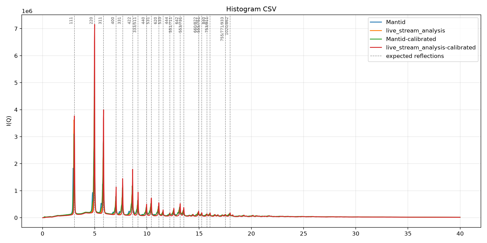
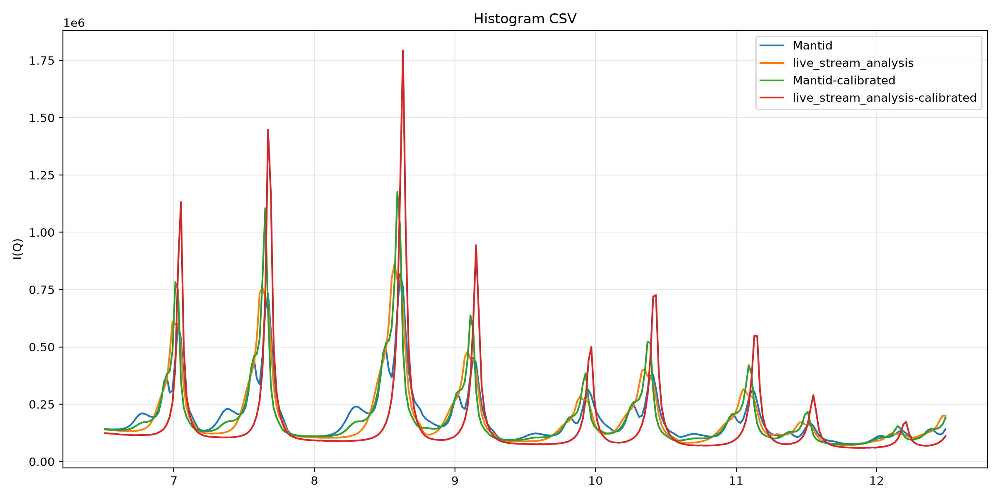
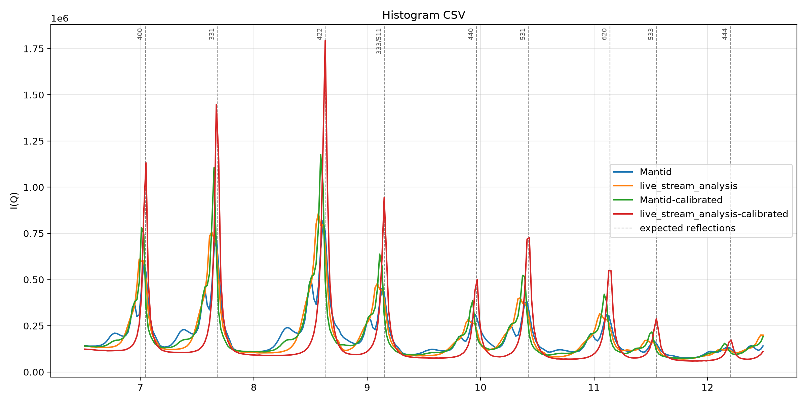

# Mantid live-data comparison scripts

Scripts for checking `live_stream_analysis` against the equivalent Mantid reduction, and for
replaying recorded ADARA data so the live path can be exercised without beam time.

As with `scripts/preparer`, the `live_stream_analysis` package stays pure-Python and does not
declare Mantid as a dependency. Mantid lives in a self-contained pixi environment in this
directory, so it never touches the project's uv environment.

## Contents

| Script | Environment | Purpose |
| --- | --- | --- |
| `adara_replay_server.py` | uv (stdlib only) | Serve recorded `.adara` files over TCP as a fake live stream |
| `mantid_iq_from_nexus.py` | pixi | Reduce a NeXus file to I(Q) with Mantid, in our CSV format |
| `mantid_live_iq.py` | pixi | Drive Mantid's `StartLiveData` against a file replayed inside Mantid |
| `compare_iq.py` | uv (stdlib only) | Diff two histogram CSVs bin-by-bin |
| `diamond_reference.py` | uv (stdlib only) | Generate expected diamond reflections from the lattice parameter |
| `check_diamond_peaks.py` | uv (stdlib only) | Measure observed peak positions against those expected values |

Plotting stays in `scripts/plot_csv_histogram.py`; pass `--with-diamond-reflections` to mark
the expected positions on any of its existing plot modes.

## How our pipeline maps onto Mantid's live-data algorithms

Mantid's live stack is three algorithms: `StartLiveData` is the user-facing entry point, which
launches `MonitorLiveData` as a background job, which calls `LoadLiveData` on a timer. Each
`LoadLiveData` call pulls one chunk of everything since the last call, runs it through an
optional processing step, accumulates it into the output workspace, then optionally
post-processes the accumulated result.

Our analyzer follows the same shape:

| Mantid | `live_stream_analysis` |
| --- | --- |
| `StartLiveData` (entry point) | `live_stream_analysis analyze --adara-stream HOST PORT` |
| `Listener` (`SNSLiveEventDataListener` for ADARA) | `readadara` `AdaraLiveStreamReader` |
| `LoadLiveData` chunk | one ADARA packet from `reader.read_generator()` |
| `ProcessingAlgorithm` (per chunk) | per-event TOF -> d -> Q via `pixel_tof_to_q` |
| `AccumulationMethod=Add` | `hist[bin] += 1` |
| `AccumulationWorkspace` | the in-memory `hist` list |
| `PostProcessingAlgorithm` (on accumulated data) | `apply_corrections` (background subtraction, vanadium normalisation) |
| `OutputWorkspace` | histogram CSV, live plot, INTERSECT `histogram.updated` event |
| `RunTransitionBehavior=Restart` | NEW_RUN clears the histogram, END_RUN finalises the run |
| `UpdateEvery` (seconds) | `--live-plot-refresh-every` (packets) and `publish_interval_seconds` (INTERSECT) |
| `PreserveEvents=False` | events are never retained; only the Q histogram |

Differences worth knowing:

- We only implement the equivalent of `AccumulationMethod=Add`. Mantid also offers `Replace`
  (latest chunk wins) and `Append` (chunks extend the workspace as new spectra).
- Mantid's `RunTransitionBehavior` also offers `Stop` and `Rename`; we always restart.
- We refresh on a packet count, Mantid on a wall-clock interval.
- Mantid accumulates into a workspace with full instrument geometry attached, so any Mantid
  algorithm can be applied downstream. We accumulate a flat list of bin counts.

## Set up the Mantid environment (pixi)

Everything is pinned in `pixi.toml` / `pixi.lock` in this directory, so this is one command:

```bash
cd scripts/live_comparison
pixi install
```

`pixi run` then executes inside that environment. Verified with Mantid 6.15.0 on linux-64.
Nothing else on the machine is touched, and no conda/mamba installation is required.

```bash
pixi run python -c "import mantid; print(mantid.__version__)"
```

---

# Walkthrough 1: compare I(Q) against Mantid, from the same NeXus file

This is the meaningful numeric check. Both sides read the same file with the same Q binning.

### 1. Reduce with Mantid

```bash
cd scripts/live_comparison
pixi run python mantid_iq_from_nexus.py \
    --nexus-file ../../nexus_files/diamond/NOM_243708.nxs.h5 \
    --histogram-q-max 40 \
    --histogram-q-bin-size 0.02 \
    --output-csv /tmp/mantid_iq.csv
```

Add `--calibration-file ../../nexus_files/calibration/NOMAD_243451_2026-06-09_shifter.h5` to
apply DIFC/DIFA/TZERO. Takes about a minute for the 1.7 GB `NOM_243708`; note that
`NOM_243709` is 15.4 GB and needs far more time and memory.

### 2. Reduce with the analyzer

From the repository root, in the uv environment:

```bash
uv run live_stream_analysis analyze \
    --nexus-file nexus_files/diamond/NOM_243708.nxs.h5 \
    --histogram-pixel-geometry-csv pixel_geometry.csv \
    --histogram-q-max 40 \
    --histogram-q-bin-size 0.02 \
    --histogram-output-csv /tmp/lsa_iq.csv
```

Use `pixel_geometry_calibrated.csv` if you passed `--calibration-file` above.

### 3. Diff them

```bash
uv run python scripts/live_comparison/compare_iq.py /tmp/mantid_iq.csv /tmp/lsa_iq.csv
```

### 4. Plot them together

Both sides emit the project's three-column format, so the existing plotter overlays them.
Running all four reductions -- Mantid and the analyzer, each with and without calibration --
in one figure:

```bash
uv run python scripts/plot_csv_histogram.py \
    ./scripts/live_comparison/mantid_iq.csv --label Mantid \
    --input scripts/live_comparison/live_stream_analysis_iq.csv --label live_stream_analysis \
    --input scripts/live_comparison/mantid_iq_calibrated.csv --label Mantid-calibrated \
    --input scripts/live_comparison/live_stream_analysis_iq_calibrated.csv --label live_stream_analysis-calibrated \
    --mode overlay --x-min 0 --x-max 40 \
    --output-png comparison.png
```



Leaving off `--output-png` opens the interactive matplotlib window instead, which is the way
to zoom around; pass both to get a window and a file. Narrowing the range shows where the
reductions actually diverge:

```bash
uv run python scripts/plot_csv_histogram.py \
    ./scripts/live_comparison/mantid_iq.csv --label Mantid \
    --input scripts/live_comparison/live_stream_analysis_iq.csv --label live_stream_analysis \
    --input scripts/live_comparison/mantid_iq_calibrated.csv --label Mantid-calibrated \
    --input scripts/live_comparison/live_stream_analysis_iq_calibrated.csv --label live_stream_analysis-calibrated \
    --mode overlay --x-min 6.5 --x-max 12.5 \
    --output-png comparison-zoomed-in.png
```



Zoomed in, the four curves clearly peak at slightly different Q, and the calibrated analyzer
(red) is both sharper and shifted right of the others. Walkthrough 1b below settles which one
is actually correct.

## What this comparison currently shows

Run on `NOM_243708` (232,190,586 events), uncalibrated on both sides:

```
Bins compared        : 2000
Max |dQ|             : 0.000e+00        <- Q axes agree exactly
Total counts         : Mantid 218,531,463  analyzer 218,458,745
  total delta        : -0.0333%
Mean relative dI     : 6.9912%
```

So the **Q axes align exactly** and the **totals agree to 0.03%**, but the per-bin
distribution differs by ~7% on average. Overlaying the two shows why: the Bragg peaks sit at
the same Q, but ours are sharper while Mantid's are broader and slightly split. That is a
geometry-source difference, not a binning bug -- Mantid uses the instrument embedded in the
NeXus file, while the analyzer uses `pixel_geometry.csv` generated from
`tests/data/idf/NOMAD_Definition.xml`. Closing that gap means generating the pixel geometry
from the same instrument definition the data file carries.

### Open question: detector masking

With `--calibration-file` on both sides the totals diverge by about 12%:

```
Total counts : Mantid 218,498,232   analyzer 192,415,745   (-11.94%)
```

The analyzer skips events from pixels whose `use` flag is 0 (41,110 of 101,376 on NOMAD);
`ApplyDiffCal` only sets DIFC/DIFA/TZERO and masks nothing, so Mantid keeps them.

Applying `LoadDiffCal`'s mask workspace is the obvious counterpart, and
`--apply-calibration-mask` does exactly that -- but it overshoots in the other direction:

```
Total counts : Mantid 112,750,901   analyzer 192,415,745   (+70.66%)
```

So the mask workspace and the `use` column are not equivalent on NOMAD, and neither setting
makes the totals line up. The flag is off by default. Resolving this needs someone familiar
with how NOMAD's `use` flags relate to Mantid's masking, and it should be settled before
these numbers are used to judge either implementation.

---

# Walkthrough 1b: check peak positions against diamond

Comparing two reductions against each other says whether they agree, not whether either is
right. Diamond gives an absolute reference: it is cubic (Fd-3m) with a well-known lattice
parameter, so its reflection positions follow from `Q = 2*pi*sqrt(h^2+k^2+l^2)/a` and are
fixed independently of any instrument.

`diamond_reflections.csv` is checked in; regenerate it with a different lattice parameter or
Q range like this:

```bash
uv run python scripts/live_comparison/diamond_reference.py --q-max 40
```

It uses a = 3.56712 A (diamond at 298 K, Hom, Kiszenick & Post, *J. Appl. Cryst.* **8**
(1975) 457-458) and the diamond reflection condition: h, k, l all odd, or all even with
h+k+l divisible by 4. That is why 200 and 222 are absent from the data.

Measure a reduction against it:

```bash
uv run python scripts/live_comparison/check_diamond_peaks.py \
    scripts/live_comparison/live_stream_analysis_iq_calibrated.csv
```

Each peak centre is refined with a parabola through the maximum bin and its neighbours, so
the result is not quantised to the bin width.

To see the same thing, add `--with-diamond-reflections` to the usual plotting script. It
works with every existing option, including `--mode subplots`, and leaving off `--output-png`
gives the interactive matplotlib window so you can zoom:

```bash
uv run python scripts/plot_csv_histogram.py \
    ./scripts/live_comparison/mantid_iq.csv --label Mantid \
    --input scripts/live_comparison/live_stream_analysis_iq.csv --label live_stream_analysis \
    --input scripts/live_comparison/mantid_iq_calibrated.csv --label Mantid-calibrated \
    --input scripts/live_comparison/live_stream_analysis_iq_calibrated.csv --label live_stream_analysis-calibrated \
    --mode overlay --x-min 6.5 --x-max 12.5 \
    --with-diamond-reflections --annotate-reflections \
    --output-png comparison-with-reflections.png
```



The dashed lines are fixed by the lattice parameter, so they settle the question the previous
plot raised: the calibrated analyzer (red) sits on them, and the other three sit consistently
to the left of them.

Related options:

- `--annotate-reflections` labels each marker with its hkl.
- `--reflection-min-intensity` hides weak reflections (default 0.5; lower it to mark more).
- `--reflections-csv PATH` marks a different material's reflections instead of diamond, using
  any CSV with `hkl`, `Q (1/A)` and `rel intensity` columns.

## Result on NOM_243708

Across 21 matched reflections spanning Q = 3 to 18:

| Reduction | mean dQ (1/A) | RMS dQ | trend in dQ/Q |
| --- | --- | --- | --- |
| **live_stream_analysis, calibrated** | **-0.0005** | **0.0012** | none, scattered about zero |
| Mantid, uncalibrated | -0.0237 | 0.0261 | roughly -0.2%, constant |
| Mantid, calibrated | -0.0472 | 0.0502 | roughly -0.35%, constant |
| live_stream_analysis, uncalibrated | -0.0747 | 0.0808 | roughly -0.75%, constant |

The calibrated analyzer places the diamond reflections on their literature positions to
about 0.001 1/A, which is a twentieth of a bin. That is an absolute check, not a relative
one, and it validates the calibrated TOF -> d -> Q path end to end.

The other three show a *constant fractional* offset rather than a constant absolute one.
`dQ/Q` staying flat with Q is the signature of a scale error -- an effective lattice
parameter, or equivalently a DIFC scale, that is slightly off -- rather than a zero offset,
which would show up as a constant `dQ`. For the uncalibrated analyzer the -0.75% scale error
means `pixel_geometry.csv`, built from the static IDF, does not match the instrument as it
was for this run. That is what the calibration corrects.

Two caveats:

- **Mantid calibrated is worse than Mantid uncalibrated** (-0.35% vs -0.2%). That is
  backwards, and suggests `mantid_iq_from_nexus.py` is not applying the calibration the way
  Mantid's own reduction would, or that the calibration file used does not correspond to this
  run. Worth resolving before treating the Mantid column as a reference.
- The 111 reflection is an outlier in every file (-1.0% to -1.4%) while its neighbours are
  consistent. It is by far the strongest and most asymmetric peak, so the parabolic refinement
  is least reliable there; do not read much into that one line.

## About the intensity column

`rel_intensity` in the reference is a kinematic estimate only: multiplicity x |F|^2 x d^4
(a TOF Lorentz factor) x Debye-Waller with B = 0.20 A^2. It ranks peaks and helps identify
them, but it will not match the data quantitatively -- these histograms are summed over all
detector banks with no vanadium normalisation or absorption correction, so the observed
intensities are dominated by instrument response. The observed pattern has 220 as the tallest
peak while this estimate puts 111 first, which is exactly the kind of disagreement to expect.
**Use the positions for validation; treat the intensities as indicative.**

---

# Walkthrough 2: replay recorded ADARA data as a live stream

`adara_replay_server.py` serves a recorded `.adara` file over TCP. The bytes in an ADARA file
are byte-identical to the bytes on the wire -- `readadara` parses a socket with the same
reader it uses for a file -- so no protocol translation is involved.

This exercises the real `--adara-stream` path: run transitions, reconnects, and INTERSECT
publishing, all from recorded data.

### Run boundaries are spread across files

A single run is split into many files, and only the last carries `END_RUN`. For run 208511:

| File | Run-status packets |
| --- | --- |
| `m00000001-f00000001` | `NEW_RUN(1)`, `RUN_EOF(2)` |
| `m00000001-f00000002` .. `f00000008` | `RUN_BOF(3)`, `RUN_EOF(2)` |
| `m00000001-f00000009` | `RUN_BOF(3)`, **`END_RUN(4)`** |

Pass the whole set to replay a complete run. `RUN_EOF` is not run completion -- only `END_RUN`
finalises, which is why the middle files do not end the run.

### Basic replay

Terminal 1, start the server:

```bash
RUN=adara_mount/20250201/adara_streams/NOMAD.Raw.Data.Runs.208511-208543/20250131-101613.350178410-run-208511
uv run python scripts/live_comparison/adara_replay_server.py \
    --adara-file $RUN/m00000001-f*.adara \
    --port 31415 --log-every 20000
```

Terminal 2, point the analyzer at it:

```bash
uv run live_stream_analysis analyze \
    --adara-stream 127.0.0.1 31415 \
    --histogram-pixel-geometry-csv pixel_geometry_calibrated.csv \
    --histogram-q-max 40 --histogram-q-bin-size 0.02 \
    --live-plot-mode browser --live-plot-keep-open \
    --histogram-output-csv /tmp/stream_iq.csv
```

The full nine-file run is roughly 1.9 GB / 235M events and takes a while. For a quick check,
replay only `f00000001` and `f00000009` -- that still spans `NEW_RUN` to `END_RUN`.

Add `--packets-per-second 200` to make it behave like a slow beamline rather than replaying
as fast as the socket allows.

### Testing reconnect

`--drop-after N` cuts the connection after N packets, and `--drop-once` applies that to the
first client only, so the reconnecting client gets a clean run through to `END_RUN`:

```bash
uv run python scripts/live_comparison/adara_replay_server.py \
    --adara-file $RUN/m00000001-f00000009-run-208511.adara \
    --port 31415 --drop-after 300 --drop-once
```

```bash
uv run live_stream_analysis analyze \
    --adara-stream 127.0.0.1 31415 \
    --histogram-pixel-geometry-csv pixel_geometry_calibrated.csv \
    --histogram-q-max 40 --histogram-q-bin-size 0.02 \
    --adara-stream-max-reconnects 3 --adara-stream-reconnect-delay 2 \
    --histogram-output-csv /tmp/reconnect_iq.csv
```

Pick a `--drop-after` smaller than the file's packet count or it never fires: `f00000009` is
only 780 packets, while `f00000001` is 8,994.

This is how the mid-stream reconnect bug was found. A reset used to reach the top-level
`OSError` handler and kill the analyzer, because only a *clean* end of stream reached the
reconnect path. `tests/unit/analyzer/test_adara_reconnect.py` now covers both that case and a
refused reconnect.

### Note on reconnect semantics

On reconnect the server replays from the beginning of its file list, whereas a real SMS would
continue from wherever the stream had reached. That is fine for exercising the reconnect and
run-transition logic, but it means the accumulated histogram after a reconnect double-counts
the replayed portion. Do not read physics into a histogram from a run that reconnected.

---

# Walkthrough 3: Mantid's own live pipeline, from a file

Mantid can replay a file through its full live stack using the `ADARA_FileReader` instrument
in the `TEST_LIVE` facility. This runs **inside Mantid** and opens no socket, so it does not
consume `adara_replay_server.py`; the two are independent demonstrations.

Point Mantid at the file to replay by adding to `~/.mantid/Mantid.user.properties`:

```
fileeventdatalistener.filename=NOM_243708.nxs.h5
fileeventdatalistener.chunks=100
```

The file must sit in one of Mantid's configured data search directories. Then:

```bash
cd scripts/live_comparison
pixi run python mantid_live_iq.py --output-csv /tmp/mantid_live_iq.csv
```

Comparing that against the analyzer's single-pass reduction of the same file checks that
chunked `Add` accumulation converges on the same I(Q).

`mantid_live_iq.py` has **not** been run end to end -- it needs the `Mantid.user.properties`
entry above and a `TEST_LIVE` facility setting, which were not configured here. Treat its
`StartLiveData` call as a starting point. `mantid_iq_from_nexus.py` and `compare_iq.py` have
both been run against real data.

## A caveat about the sample data

The ADARA files under `adara_mount/` are runs 208511-208629 (Feb 2025); the NeXus files under
`nexus_files/` are runs 243708-243712 (June 2026). No run is present in both formats, so an
ADARA-vs-NeXus comparison of the same run is not possible with the data checked out here. The
NeXus comparison is still meaningful because both source paths share `pixel_tof_to_q`.
